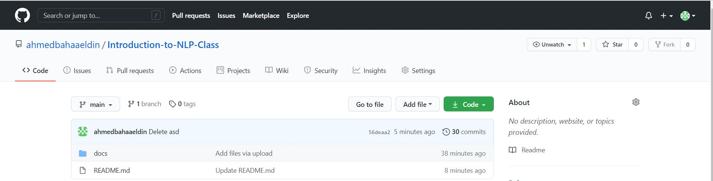
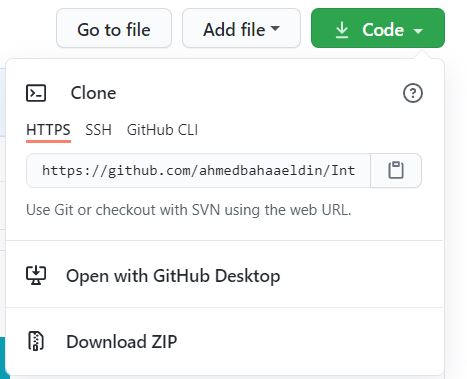
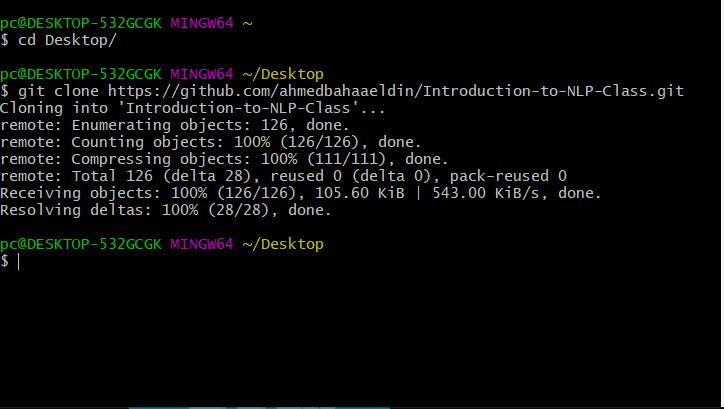
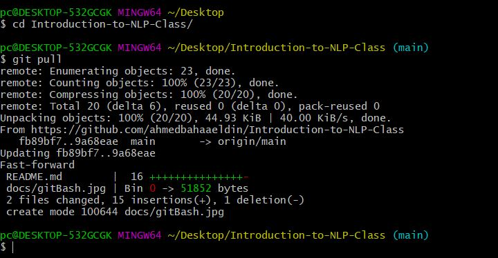

<div align="center">

   
    


  
  **CIE 553:Introduction to NLP Class repository for Students Material.**
  
  
  
  [](mailto:ahmedbahaa944@gmail.com)
  [](mailto:eng.robagamal@gmail.com)
  
</div>

 -------------------------------------------------------------------------------- 
 
### You found a bug or have a fruitful suggesstion ?
Please, [open an issue][issue].

If you solved it [open a pull request][pr]!. 

## Contents:
- [Installation](#installation)
- [Tutorials](#tutorials)

## Installation
([↑up to contents](#contents))
First you need to download [Git][git]. Select your OS from macOS, Windows, Linux/Unix.

After the completion of the installment, you should be able to clone any repository now. Git is mainly used as a version control tool as there is no perfect software and there is always bugs/issues. So there is an essential need to maintain a working version of the software while keeping track of progress.

Cloning a repository makes contributing to open source projects easier as when you add new feature, you design it on your local machine then ask the owner to push your code.

#### How to clone a repo ?
 - First you go to repo main page. Like our repo. 

<div align="center">

</div>

-------------------------------------------------------------------------------- 

 - Then you select the download button and click the copy button.

<div align="center">

</div>

-------------------------------------------------------------------------------- 

- Then you open the Git Bash. Using ``` cd: change directory ``` to allocate the repo in your work area. Then type ``` git clone + URL you copied ```

<div align="center">

</div>

-------------------------------------------------------------------------------- 

- Now you successfully have the current version of the repo. If there is a release of a new assignment or any material. 
You can simply use ``` git pull ``` command where you literally pull the latest version of the code. You first go to the directory where you saved your repo and type the command.

<div align="center">

</div>

-------------------------------------------------------------------------------- 

## Tutorials
([↑up to contents](#contents))

<div class="Tut">
|Tutorial | Resources
 |------------ | ------------------------ 
|Tutorial 1 | [Introduction to python][tut1]
</div>

.Tut table {
   min-width: 100%;
}

[issue]: https://github.com/ahmedbahaaeldin/Introduction-to-NLP-Class/issues/new
[pr]: https://github.com/ahmedbahaaeldin/Introduction-to-NLP-Class/compare
[git]: https://git-scm.com/download/
[tut1]: https://github.com/ahmedbahaaeldin/Introduction-to-NLP-Class/blob/main/Tutorials/Intro_to_python.ipynb

